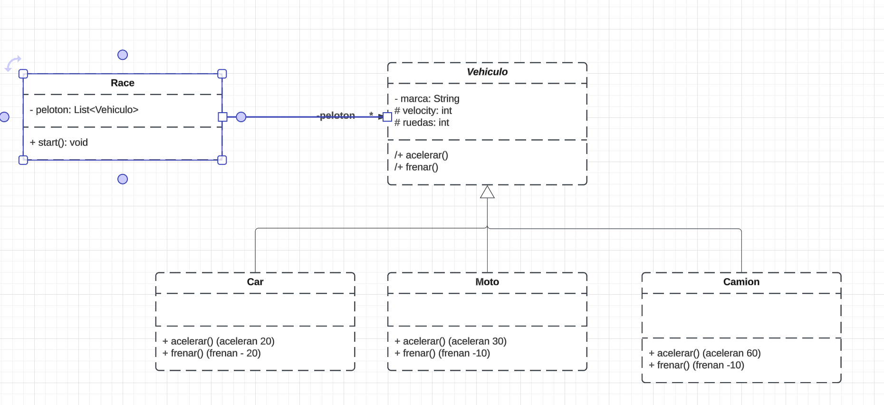

# Ejercicio herencia "Vehículo"
Este proyecto se llevó a cabo como parte de un campamento de entrenamiento, cuyo objetivo principal es practicar la herencia y el polimorfismo en la programación orientada a objetos.
